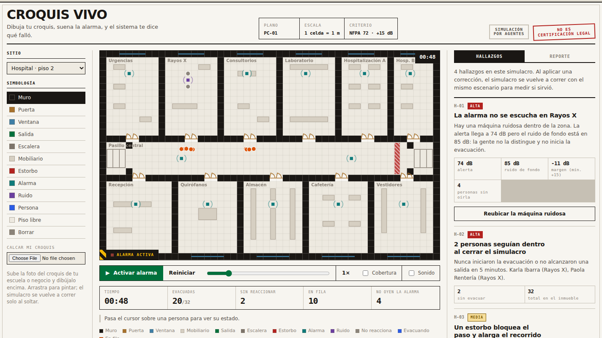
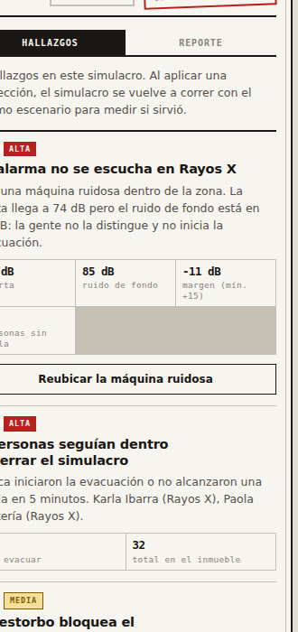
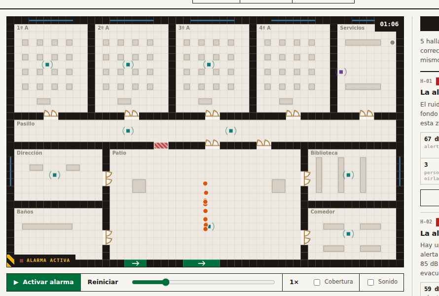
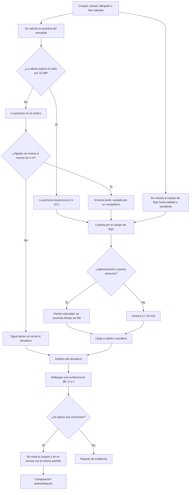
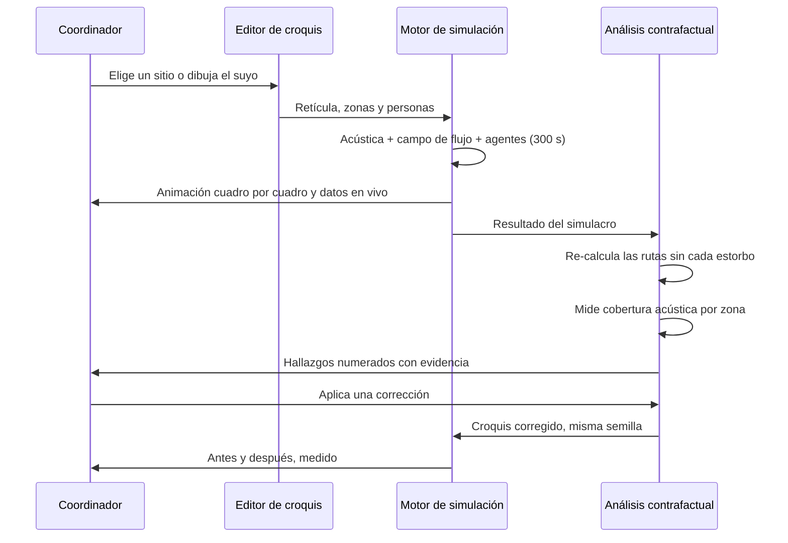

# PACKET — Croquis Vivo
**Semana 6 · AI 2041 Cap. 5 "My Haunting Idol" · Rol: MONEY · Vacío: Compliance-upgrade**

## El problema, en mis palabras
Todo hospital, escuela y empresa en México está obligado por ley a mantener un Programa Interno de Protección Civil con simulacros documentados. El simulacro típico sólo registra **asistencia**: quién estuvo en el patio. No registra quién nunca oyó la alarma, qué estorbo bloqueó la ruta, ni dónde se hizo la fila. El director compra el curso más barato porque no existe nada mejor, y frente a una inspección o un sismo real esa lista de firmas no prueba nada.

El gasto ya existe. Lo que falta es que ese gasto compre evidencia.

## Usuario exacto
El coordinador de Protección Civil de un hospital privado mediano en Ciudad de México: es el responsable legal de que el personal esté entrenado y de tener la documentación lista cuando llegue la inspección. Segundo usuario, mismo producto: el director de una primaria pública que corre el Simulacro Nacional cada septiembre.

## Definición de éxito
*Antes de que cierre el módulo:* cualquier persona puede abrir la URL, activar la alarma sobre el croquis de un hospital o de una escuela, ver a las personas moverse, y obtener una lista de hallazgos con números —cuántos no oyeron la alerta y por qué, cuánto recorrido extra causa un estorbo, cuántos se atoraron en fila— y luego aplicar una corrección y ver el simulacro re-calculado para comprobar si sirvió.

## Qué hace, pantalla por pantalla

El croquis es editable: muros, puertas, ventanas, salidas, escaleras de emergencia, mobiliario, estorbos, altavoces, máquinas ruidosas y personas. Al activar la alarma cada persona reacciona (o no), busca su salida más cercana y se frena cuando hay aglomeración.

Los hallazgos se numeran como notas de plano (H-01, H-02…), con severidad y evidencia en dB, metros y segundos. Los que tienen corrección disponible traen un botón que la aplica y vuelve a correr el mismo escenario.

El mismo motor sobre una primaria: cuatro salones con pupitres, patio, dirección, baños, biblioteca y comedor.

## Flujo (Mermaid)

## Benchmark
La mejor solución existente en el mundo para esto es **FEMA / Meta / Ad Council, "The Escape Plan"**: conecta la práctica inmersiva con un plan de escape real en vez de quedarse en contenido. También existe **VR BOSAI** del Cuerpo de Bomberos de Tokio, donde la autoridad misma usa experiencia inmersiva para prevención.

La mía difiere y localiza en tres cosas: corre sobre **el croquis del inmueble propio** (no un escenario genérico de catálogo), no necesita visor ni hardware —se abre en cualquier navegador, que es lo que un hospital o una primaria pública sí puede pagar—, y produce un **reporte de evidencia por zona** pensado para el Programa Interno de Protección Civil mexicano, con la separación explícita entre evidencia de capacitación y certificación legal.

## Visión a 3 años (light charter)
Si esta rebanada funciona, Croquis Vivo se vuelve la capa de evidencia detrás del Programa Interno de Protección Civil obligatorio en México: cada inmueble sube su croquis una vez y corre su simulacro anual con él, acumulando un historial de qué tan preparado está y qué corrigió. La segunda capa es el inventario nacional de errores físicos —dónde hay estorbos crónicos, qué zonas nunca oyen la alarma— que hoy no existe en ninguna base de datos. La tercera es el puente con las aseguradoras, que necesitan reducción de riesgo verificable y hoy no tienen ninguna señal de preparación que puedan leer.

## Qué NO se construyó (scope cut)
- **No es una app de información sobre sismos.** No dice qué hacer en un sismo, no da noticias, no alerta. Es un ensayo medido, que es lo que pide el forbidden zone de esta semana.
- **No es VR inmersiva con visor.** Es simulación por agentes en 2D sobre el croquis, etiquetada como tal en la propia página.
- **No emite certificación legal** ni se integra con ninguna API de Protección Civil: no existe y prometerlo sería exactamente la sombra del capítulo.
- **No usa un modelo de lenguaje.** El motor es determinista y el pie de página lo dice.
- **No hay cuentas, login ni base de datos.** Todo vive en la sesión del navegador; no se captura ni se envía dato personal de nadie.
- No hay varios pisos, ni humo, ni fuego, ni personas con movilidad reducida modeladas aparte.

## Arquitectura y stack (Dragon Stack)

| Capa | Qué hace | Cómo está hecho |
|---|---|---|
| Simulación | Agentes que reaccionan, buscan ruta, se aglomeran y salen; 300 s grabados cuadro por cuadro para poder reproducir y arrastrar la línea de tiempo | `src/lib/engine.ts`, Canvas 2D, sin librerías |
| Lógica adaptativa | Análisis contrafactual: re-calcula el campo de flujo sin cada estorbo y la cobertura acústica por zona; genera hallazgos con severidad y corrección aplicable; re-simula con la misma semilla para comparar | `analyze()` y `flowField()` en `engine.ts` |
| Geodata | El croquis como retícula de 1 m: muros, puertas, ventanas, escaleras, mobiliario y zonas nombradas; se puede calcar la foto de un croquis real | `src/lib/sites.ts` y el editor del canvas |
| Acústica | Propagación con pérdida por distancia y por cada barrera cruzada; criterio de audibilidad NFPA 72 (+15 dB sobre el ruido de fondo) | `acoustics()` y `attOnLine()` |
| App | Next.js 16 (App Router) + TypeScript + React 19, sin dependencias de UI | `src/components/CroquisVivo.tsx` |
| Hosting | Vercel, deploy automático en cada push a `main` | GitHub → Vercel |

## Plan de pruebas
1. **Pase mecánico.** Correr los tres croquis (hospital, escuela, casa) de principio a fin y verificar: que todas las personas con ruta lleguen a una salida, que los hallazgos aparezcan con números coherentes, que la corrección re-simule y muestre el antes/después, y que la consola no tire errores.
2. **Pase de borde.** Dibujar un croquis nuevo desde cero, cerrar una salida con muro y comprobar que el sistema reporta gente sin ruta en vez de fallar en silencio.
3. **Persona test.** Sofía Ramírez, 46, directora de una primaria pública, usa WhatsApp y Excel, no ha tocado un software de simulación nunca. Caminarla pantalla por pantalla y registrar dónde duda y dónde abandonaría.
4. **Piso de seguridad.** Sin secretos en el repo, sin datos personales reales (todo el personal es inventado y está etiquetado como tal en la interfaz), sin backend ni base de datos, y validación de los límites del croquis al pintar.
