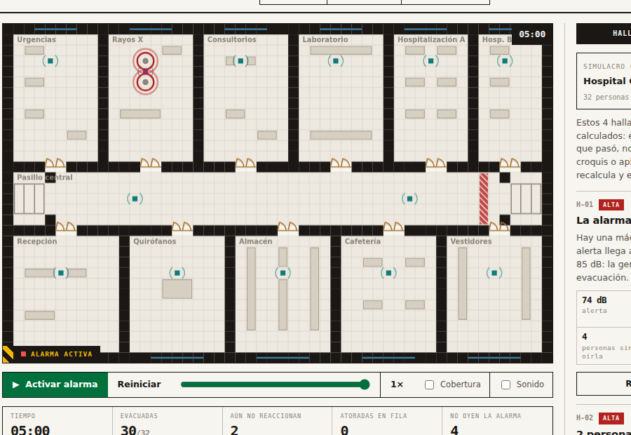

# PERSONA TEST — Croquis Vivo
**Semana 6 · AI 2041 · Capa 1: usuario sintético**

## Quién fue la usuaria sintética

**Sofía Ramírez, 46 años.** Directora de una primaria pública en Iztapalapa. Diecinueve años en el sistema educativo. Es la responsable del Programa Interno de Protección Civil de su escuela y cada septiembre organiza el Simulacro Nacional con 380 alumnos.

Usa WhatsApp todo el día, Excel para listas de asistencia y Word para oficios. Nunca ha usado un software de simulación, ni un videojuego, ni una herramienta de diseño. Desconfía de la tecnología que promete resolver lo que ella resuelve a mano: ya le vendieron "plataformas" que nadie volvió a abrir. Lee rápido y se salta los textos largos. Si no entiende algo, no pregunta: se sale.

Le importa una cosa: que si tiembla de verdad, los niños salgan. Y le da miedo que un día le pregunten qué hizo para prevenirlo y no tenga más que hojas de firmas.

## Cómo se corrió

Se abrió una conversación nueva, se le dio la persona, y se le pasaron cuatro capturas del producto en orden —pantalla inicial, simulacro corriendo, simulacro terminado y pestaña de reporte— pidiéndole narrar en voz alta qué mira, qué no entiende, qué le picaría y en qué momento exacto cerraría la pestaña. No se le dieron instrucciones de uso, igual que a una directora a la que alguien le pasa un link.

## Las cinco confusiones, de peor a menor

### 1. "Datos inventados" destruía la credibilidad del único entregable útil
La etiqueta *"Personas (datos inventados)"* estaba dentro del bloque titulado *"Evidencia del simulacro"*, sin separación visual entre lo inventado (los nombres del demo) y lo calculado (tiempos, conteos, decibeles). Sofía llevaba cuatro pantallas creyendo que Karla Ibarra de Rayos X no había salido, y de golpe le dicen que Karla Ibarra no existe.

> "Ahí se me cae todo. ¿Y los 32? ¿Y el 01:48? ¿También inventados? Ya no confío en ningún número de la página."

Sumado al sello rojo de la cabecera, su conclusión fue: *"esto es una maqueta bonita, no una herramienta"*. **Probabilidad de abandono: muy alta**, y con veredicto — no regresa ni recomienda.

### 2. Los hallazgos estaban ahí antes de correr nada, y no cambiaban después
Al abrir, el reloj marcaba 00:00 y 0/32 evacuadas, pero el panel derecho ya mostraba cuatro hallazgos con nombres y decibeles. Al terminar el simulacro, ese panel era idéntico píxel por píxel.

> "Los resultados ya estaban escritos. ¿Para qué corrí el simulacro?"

Lo grave es que los hallazgos son la propuesta de valor central —"el sistema te dice qué falló"— y quedaban bajo sospecha de ser cartón pintado. **Abandono: alto**, y envenena la lectura de todo lo que viene después.

### 3. Todo el contexto era un hospital de 32 adultos
Urgencias, Rayos X, Quirófanos; nombres de adultos; 32 personas contra sus 402. Dos descartes al mismo tiempo: uno cuantitativo ("este motor no aguanta mi problema") y uno emocional (no vio un solo sustantivo de su mundo: salón, patio, alumno, brigada). El selector de sitio existía, pero era un control gris y chiquito encima de una columna que ella leyó como "leyenda del dibujo", no como "aquí eliges tu escenario". **Abandono: alto, y el más temprano de todos** — en los primeros 20 segundos, antes de que el producto demuestre nada.

### 4. "0 evacuadas / 30 sin reaccionar" se leía como falla del sistema
A los tres segundos de activar la alarma, nadie se movía. Su modelo mental es binario: le pico, funciona.

> "Veo cero y pienso error. Y 'SIN REACCIONAR' suena feo, como si yo hubiera hecho algo mal."

Peor: *"EN FILA"* significa lo contrario en el vocabulario escolar, donde formar fila es el objetivo del simulacro, no un síntoma de congestión. **Abandono: medio-alto, por deriva** — no cierra la pestaña, se va a WhatsApp durante la espera y no vuelve.

### 5. El botón más atractivo era el que más miedo daba tocar
*"Reubicar la máquina ruidosa"* era lo único accionable el lunes, y no le picó: no sabía si modificaba el plano, si se podía deshacer, ni si perdía lo que ya tenía. La explicación existía, pero en un párrafo gris que este perfil se salta por definición. **Abandono: medio.** No expulsa, pero bloquea justo el momento en que el producto pasa de curiosidad a herramienta.

### Nota transversal
Al terminar, con dos personas sin evacuar, el plano no marcaba dónde quedaron. El momento de mayor carga emocional del producto —*alguien se quedó adentro*— se entregaba como texto en un panel lateral, a 700 píxeles de donde estaba su ojo.

## Qué se arregló

**La #1, que era la peor**, y de paso las otras cuatro y la nota transversal, porque todas eran baratas una vez identificadas:

| # | Antes | Ahora |
|---|---|---|
| 1 | "Personas (datos inventados)" dentro de "Evidencia del simulacro" | El reporte abre declarando el alcance: *"Lo que estos números sí son: el resultado medido del simulacro sobre este croquis. Lo que no son: la certificación, que sólo emite Protección Civil. Los nombres del personal son inventados; las mediciones no."* La tabla se titula "Personas · nombres inventados, mediciones reales" |
| 2 | El panel de hallazgos se veía igual antes y después de correr | Encabezado que amarra los hallazgos a su corrida: sitio, personas, evacuadas y última salida. Y se dice explícito que el simulacro ya está calculado y que el botón lo reproduce, no lo recalcula |
| 3 | El selector de sitio parecía parte de la leyenda | Lleva etiqueta propia: "Cambia de escenario aquí" |
| 4 | "Sin reaccionar" / "En fila" | "Aún no reaccionan" / "Atoradas en fila" — desambigua la fila de congestión de la fila de formarse |
| Nota | Quien no evacuaba sólo aparecía como texto en el panel | Se marca con doble anillo rojo sobre el plano, en el cuarto donde se quedó |

## Lo que la prueba dejó claro y no estaba en el plan

Sofía nunca dudó del motor: entendió sola que las ondas verdes eran el sonido saliendo, y adivinó que el punto morado sin ondas era la máquina ruidosa. Lo que la expulsaba no era la simulación, era **el lenguaje alrededor de la simulación**: una etiqueta de honestidad mal colocada hacía más daño a la confianza que cualquier error de cálculo.

Lo que sí la detuvo antes de cerrar fue una sola frase: *"2 personas seguían dentro al cerrar el simulacro"*, con nombre y apellido.

> "Eso es lo que me quita el sueño. Que se quede un niño adentro. Que el papel diga 'evacuación exitosa' y que no sea cierto."

Ese es el producto. Todo lo demás es andamio.
